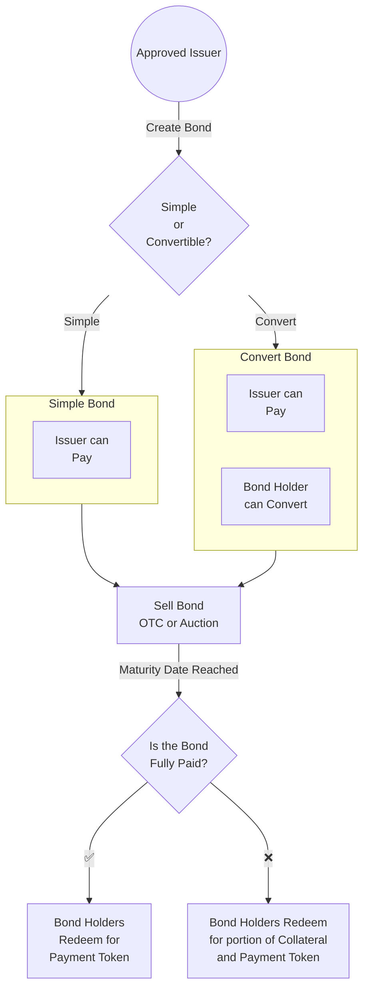

# Contracts Overview



## BondFactory

The `BondFactory` facilitates the creation of new bonds. Initially, only [authorized](spec/permissions.md#issuer---issuer_role) addresses will be able to create a `Bond` through the `BondFactory`.

## [Bond](./bond.md)

A new `Bond` contract is created for issuance. The entity creating the bond is know as a [borrower](https://docs.porter.finance/portal/participants/borrowers). `Bond` implements the standard EIP-20/ERC20 token methods as well as Porter specific methods. Each `Bond` represents a [zero coupon bond](https://docs.porter.finance/portal/financial-concepts/zero-coupon-bonds) that can be purchased by [lenders](https://docs.porter.finance/portal/participants/lenders).

# User Roles

## Borrowers

Borrowers are on chain entities that want to borrow stablecoins using their native token as collateral with a fixed interest rate and no liquidation risk.

- Creation, depositing collateral, and minting new bond shares via `initialize()`
- Withdrawing collateralToken via `withdrawExcessCollateral()`
- Withdrawing paymentToken via`withdrawExcessPayment()`
- Handling convertibility via a configured ratio and the ability for lenders to convert their `BondTokens` using `convert()`
- Handling payment for the issuer via `pay()`
- Allowing bond redemption for the bond holders via `redeem()`

To borrow money, a borrower has to issue a bond and then sell it.

### Issue Bond

Borrowers decide on multiple parameters and call the `Factory.createBond` method, passing in their address as the owner.

```solidity
/**
    @notice Creates a new Bond. The calculated ratios are rounded down.
    @param name Passed into the ERC20 token to define the name.
    @param symbol Passed into the ERC20 token to define the symbol.
    @param maturity The timestamp at which the Bond will mature.
    @param paymentToken The ERC20 token address the Bond is redeemable for.
    @param collateralToken The ERC20 token address the Bond is backed by.
    @param collateralTokenAmount The amount of collateral tokens per bond.
    @param convertibleTokenAmount The amount of convertible tokens per bond.
    @param bonds The amount of Bonds given to the owner during the one-time
        mint during the `Bond`'s `initialize`.
    @dev This uses a clone to save on deployment costs which adds a slight
        overhead when users interact with the bonds, but also saves on gas
        during every deployment. Emits `BondCreated` event.
    @return clone The address of the newly created Bond.
*/
function createBond(
  string memory name,
  string memory symbol,
  uint256 maturity,
  address paymentToken,
  address collateralToken,
  uint256 collateralTokenAmount,
  uint256 convertibleTokenAmount,
  uint256 bonds
) external returns (address clone);

```

This method creates a new bond and transfers the bond ownership to the caller of the `createBond` method.

After a bond is issued, there are a few things the borrower can do.

### Pay

This gives the ability for a borrower to pay their debt. Paying allows the borrower to withdraw any collateral that is not used to back convertible tokens. After the maturity date and grace period passes, all collateral can be withdrawn and the bond will be considered to be `PAID`. At this time, lenders lose the ability to convert their bond tokens into the collateral token. Lenders gain the ability to redeem their bond tokens for the payment token.

### `Bond.pay()`

The borrower can call this method to deposit payment tokens and unlock their collateral. This will typically be done a week before the maturity date of the bond.

### `Bond.withdrawExcessCollateral()`

After paying, the borrower can call this method to withdraw any collateral that has been unlocked. The borrower can also call `Bond.burn()` to burn any bonds they own and unlock collateral to withdraw at (collateralRatio \* burnedBonds)

### Sell Bonds

Borrowers can sell their bond shares through the [Porter App](https://app.porter.finance) which uses [Gnosis Auction](https://github.com/gnosis/ido-contracts) for price discovery and bond share distribution.

## Lenders

Lenders are able to purchase bond shares through the auction.

Once purchased, lenders can execute actions on the bond shares such as transfer, redemption or conversion.

### `Bond.redeem()`

After maturity, bonds holders have the option to call the `.redeem()` method to redeem their bonds. If the bond has been paid, they burn their bonds in exchange for the payment token at a value of 1 bond to 1 payment token.

If the bond has not been repaid and is in a defaulted state, bond holders are able to burn their bond shares for a pro rata amount of the collateralToken.

### `Bond.convert()`

Bondholders can burn their bond shares in exchange for the collateralToken at any time before bond maturity at the predefined `convertibilityRatio`.
